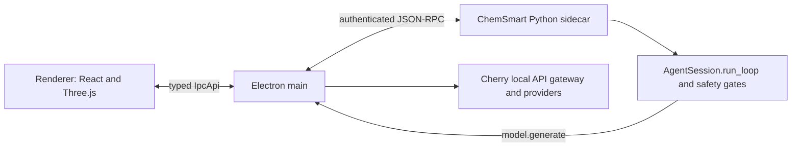

# ChemSmart Studio architecture

## Process boundary

ChemSmart Studio is an Electron/React application with one Python 3.11 sidecar.
Cherry owns chat, providers, and window lifecycle. Electron main owns molecule
documents, projects, approvals, and process supervision. The renderer draws
validated display documents with `packages/chem-molecular-engine` and Three.js.
The Python sidecar hosts the ChemSmart agent, molecular import, and the portable
trajectory ledger.



There is no molecule-editor helper process. The renderer cannot access Node,
sockets, subprocesses, provider credentials, or unapproved filesystem paths.
All renderer inputs and sidecar messages are schema validated in main.

## State authority

| State | Authority | Persistence |
|---|---|---|
| Chat, model configuration, approval UI | Cherry | Cherry data layer |
| Committed molecule, preview, undo/redo | Electron main | `MoleculeProjectStore` |
| Display-only run and replay geometry | Electron main lease | transient renderer event |
| Agent loop, gates, execution receipts | ChemSmart sidecar | append-only session and artifact ledgers |
| Portable optimization trajectory | Python sidecar | `runs/<runId>/events.ndjson` |
| IPC and molecule contracts | `schemas/` | generated TypeScript and Python models |

The canonical project is a package directory:

```text
example.cmsproj/
  manifest.json
  molecule.json
  runs/<runId>/events.ndjson
  receipts/<receiptId>.json
```

Main is the only `.cmsproj` writer and active-project-path owner. Project
transactions write a same-directory journal and private temporary files, sync
them, rename them into place, and only then publish a new in-memory revision.
Startup accepts only hash-valid recovery journals.

## Molecule and display state

1. A committed `MoleculeDocument` contains stable atom and bond IDs, explicit
   topology, geometry, constraints, and a monotonic revision.
2. Agent structure edits are previews bound to an exact base revision.
3. Commit, discard, undo, and redo execute through the main-owned document and
   durable project transaction.
4. Selection is transient view state and is never a project revision.
5. Run and replay frames are verified against run identity, document identity,
   revision, atom IDs, atomic numbers, and geometry hash.
6. The renderer receives a human-only display event whose binding is
   `committed`, `run`, or `replay`. Run/replay display never mutates the committed
   molecule.

## Optimization lifecycle

The controlled runtime supports xTB/GFN2-xTB through a supervised local
executable. Gaussian and ORCA completed histories remain replayable. Historical
Avogadro/UFF plans are inspectable but cannot be resumed or executed.

Starting a run uses a main-owned prepare/commit/abort handshake. Each accepted
frame is appended to the Python trajectory ledger before it is published to the
stage. `activeRunId` remains set while running and while awaiting the final
geometry decision. Acceptance commits the latest verified frame through the
normal durable molecule transaction and remains undoable; rejection preserves
the current revision. A closed write-ahead event union supports deterministic
recovery of torn accept/reject decisions.

## Approval and path boundaries

The agent can execute only schema-classified tools. `run_local`, `submit_hpc`,
and `execute_chemsmart_command` always require a one-shot approval bound to the
exact validated arguments. `recommend_method` and the Studio-narrowed
`inspect_calculation` are read-only; the latter accepts only an opaque run ID and
receives roots internally.

Human project surfaces may show real paths. Agent contracts remain path-free.
Renderer project tabs use opaque handles whose reverse mapping exists only in
main. Molecular import uses a bounded opaque capability: main retains the path,
performs no-follow identity checks, and serves fixed-size chunks to Python.

## Packaging boundary

The package contains the Electron application, the portable Python bridge,
schemas, notices, lock metadata, and corresponding-source information. It does
not contain Qt, Avogadro, IOSurface helpers, UFF adapters, fork-owned C++, or C++
generated protocol models. Signing, notarization, publication, and real
chemistry remain separately authorized release actions.
