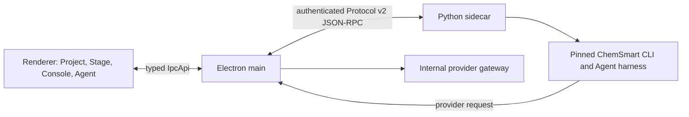

# ChemSmart Studio architecture

## Process boundary

ChemSmart Studio is an Electron/React application with one supervised Python
3.11 sidecar. The inherited provider, window, lifecycle, data, and shared-UI
foundations remain internal. Electron main owns molecule documents, projects,
drafts, approvals, runs, and process supervision. The renderer presents
validated state and draws complete molecule documents through
`packages/chem-molecular-engine` and Three.js. The Python sidecar hosts the
pinned ChemSmart Agent adapter, bounded molecular import, and portable
trajectory storage.



There is no molecule-editor helper process. The renderer cannot access Node,
sockets, subprocesses, provider credentials, or unrestricted filesystem paths.
Main schema-validates renderer input and sidecar messages.

## Active contract

`schemas/v2` is the only active runtime contract source. It generates versioned
TypeScript and Python models and the `PROTOCOL_VERSION` and `SCHEMA_SHA256`
identity. After sidecar authentication, main compares protocol version, schema
hash, and pinned ChemSmart commit before publishing ready state.

v1 is a narrow historical decoder for existing project bundles, receipts,
trajectories, and conversation data. Reads normalize into current memory shapes;
the first successful mutation upgrades the project transactionally. New projects,
runtime events, and ledgers are v2.

## State authority

| State | Authority | Persistence |
|---|---|---|
| Project path, manifest, committed molecule | Electron main | `MoleculeProjectStore` journaled transaction |
| Recoverable draft and undo/redo | Electron main | private draft journal |
| Selection, camera, hover, active tool | Renderer | transient view state |
| Display-only run and replay geometry | Electron main lease | transient renderer projection |
| Agent thread binding, approvals, controlled run | Electron main | private Studio state and receipts |
| Agent loop, parser, intent/semantic gates | Pinned ChemSmart through Python | normalized private session ledger |
| Portable trajectory | Python sidecar | `runs/<runId>/events.ndjson` |
| Cross-process meaning | `schemas/v2` | generated TypeScript and Python models |

The canonical project is a package directory:

```text
example.cmsproj/
  manifest.json
  molecule.json
  runs/<runId>/events.ndjson
  receipts/<receiptId>.json
```

Main is the only `.cmsproj` writer and active-path owner. It writes a
same-directory journal and private temporary files, syncs them, renames them,
and only then publishes a new in-memory revision. Startup accepts only
hash-valid recovery journals.

## Integrated workbench flow

1. Explorer selects a main-issued project handle. Main validates and switches
   the project, rebinds the sidecar, and publishes documents and Agent context.
2. Stage sends stable-ID gesture intents. Main applies validated edits to the
   recoverable draft and returns a complete display document; Three.js never
   owns chemistry state.
3. Save or Run reviews the ordered draft and publishes at most one durable
   molecule revision. Run then enters its separate exact approval boundary.
4. Human Console completion is generated from the pinned ChemSmart Click tree.
   Completion starts no process; submitted commands pass deterministic preflight.
5. Agent threads receive a path-free visible-molecule context. Safe text streams
   transiently, host callbacks produce grouped tool activity, and validated
   answers/artifacts become the durable projection.
6. Jobs shows controlled execution, durable frames, replay, cancellation, and
   the final-geometry decision. Run/replay display never mutates the committed
   molecule.

Raw project YAML remains the data authority. Explorer, Console-selected YAML,
and Agent candidates share one read-only semantic renderer. The Agent may use
`render_project_yaml` for Gaussian/ORCA planning; a digest-bound one-shot
decision over its `changedSections` summary and a main-owned atomic write are
required to publish a candidate.

## Approval and path boundaries

Human Explorer and Console routes may deliberately display or accept real paths.
Agent contracts remain path-free and receive opaque project/context/artifact IDs,
safe names, hashes, and normalized scientific summaries only. Main keeps every
reverse path map and revalidates file identity at use time.

`run_local`, `submit_hpc`, and `execute_chemsmart_command` always require exact
one-shot approval. Approval is bound to validated arguments and current molecule
identity; denial starts no process and terminalizes the turn. Draft editing may
accumulate without per-edit approval, but Save/Run review remains the publication
boundary.

## Packaging boundary

The internal package contains the Electron application, portable Python bridge,
Protocol v2 models, notices, lock metadata, and corresponding-source information.
It excludes Qt, Avogadro, IOSurface helpers, UFF adapters, fork-owned C++, C++
generated models, credentials, training capture, and Agent session data.
Ad-hoc signing supports integrity checks only; Developer ID signing, notarization,
publication, and real chemistry remain separately authorized actions.
